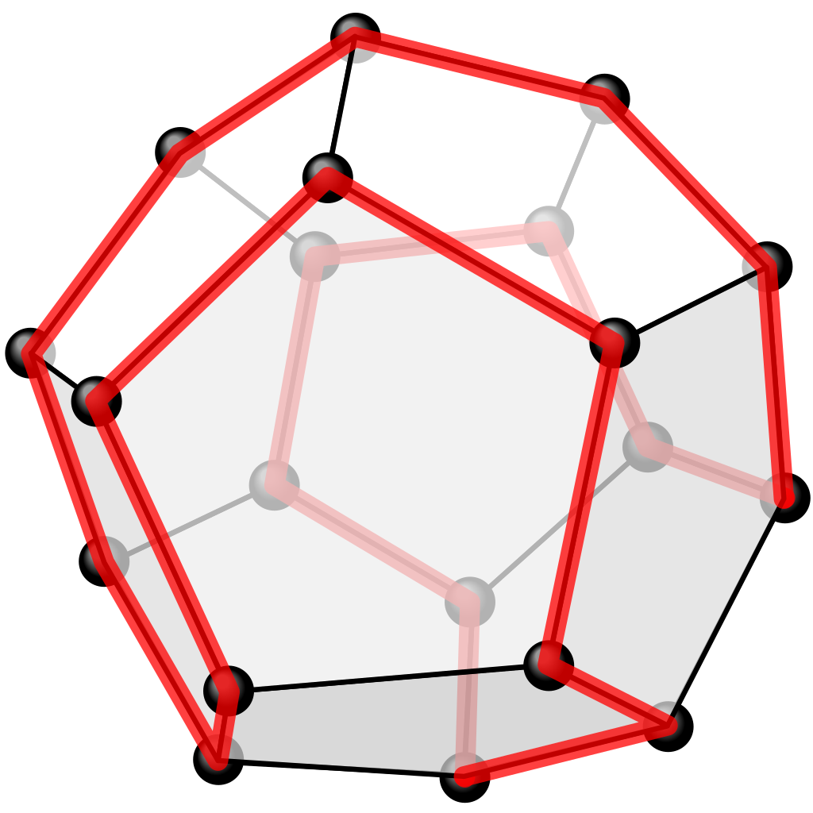
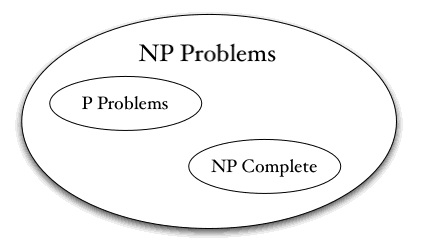
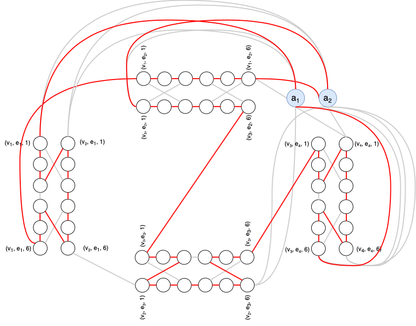

# **Hamiltonian Circuit Problem**

   
  

## Introuduction
The **Hamiltonian Circuit** problem consist in finding a path in a graph (directed or
undirected) that visits each vertex exactly once.

The aim of this project is to **prove that this problem is NP-Complete**.

   
  

## Report
In the [article](report/pdf/article), we show a prove of np-completeness,
based on the aproximation of *Michael Garey and David S. Johnson*. (in spanish :es:)

   
  

## Implementation
We implemented a **polinomial time transformation** between a *Vertex Cover instance*
and a *Hamiltonian Circuit*, one of the necessary conditions to be np-complete.

## Authors

* **Carlos Domínguez García** - [carlosdg](https://github.com/carlosdg)
* **Daute Rodríguez Rodríguez** - [DauteRR](https://github.com/DauteRR)
* **Alberto Jesús González Álvarez** - [AlberTJ97](https://github.com/AlberTJ97)
* **Cristian Abrante Dorta** - [CristianAbrante](https://github.com/CristianAbrante)
