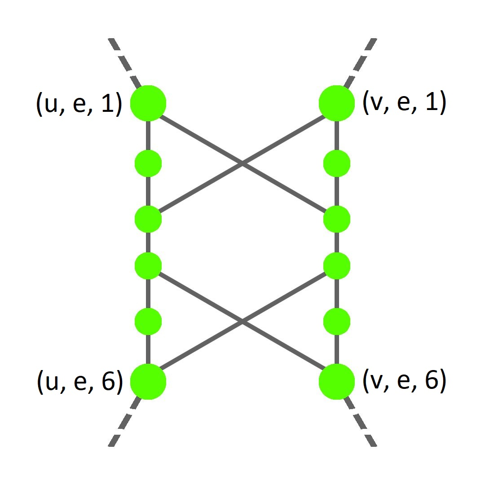
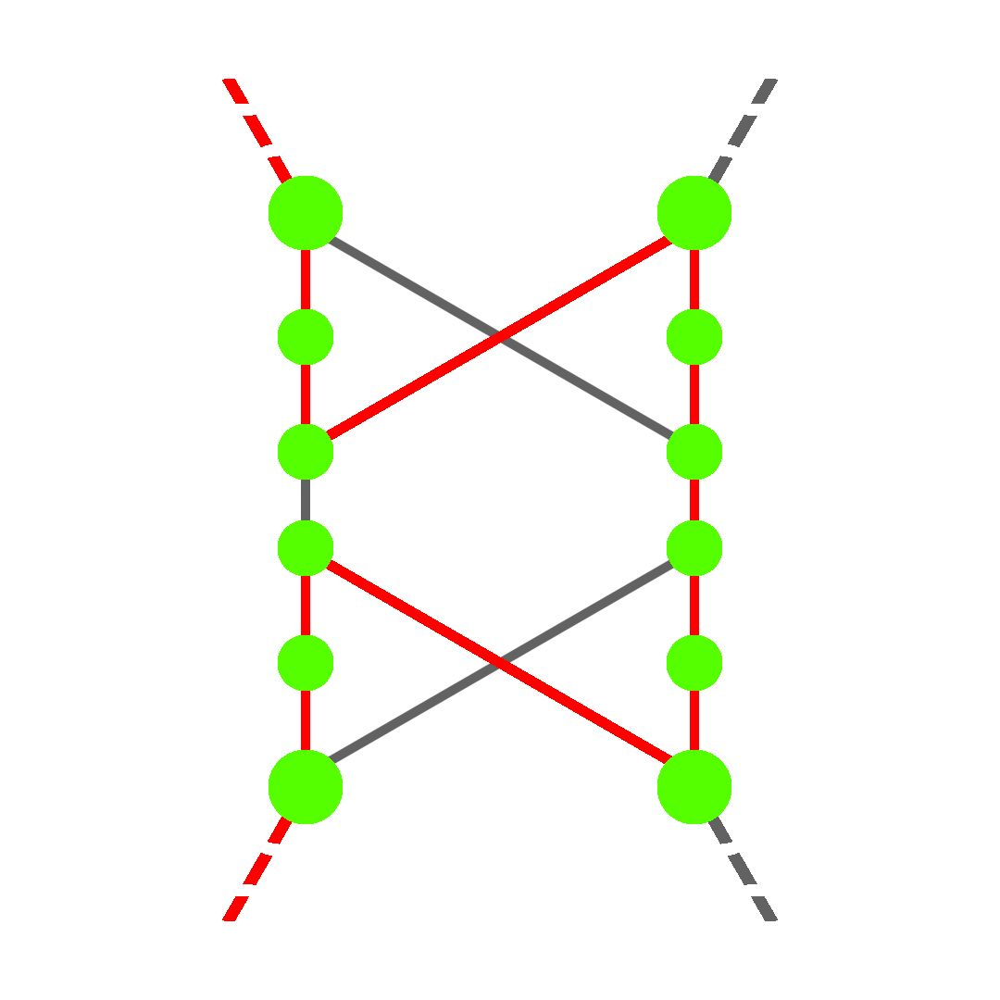
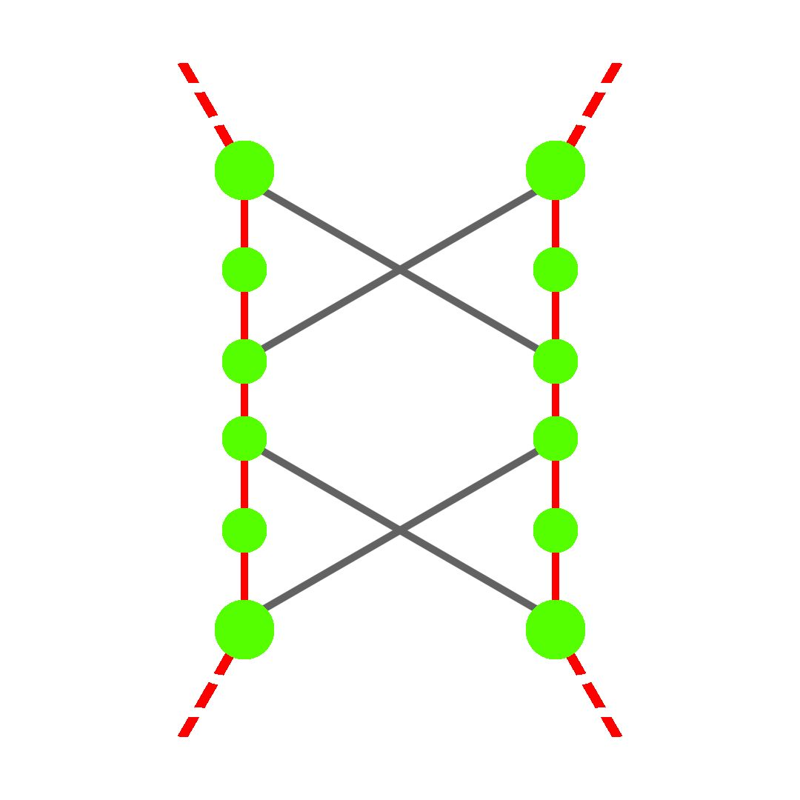
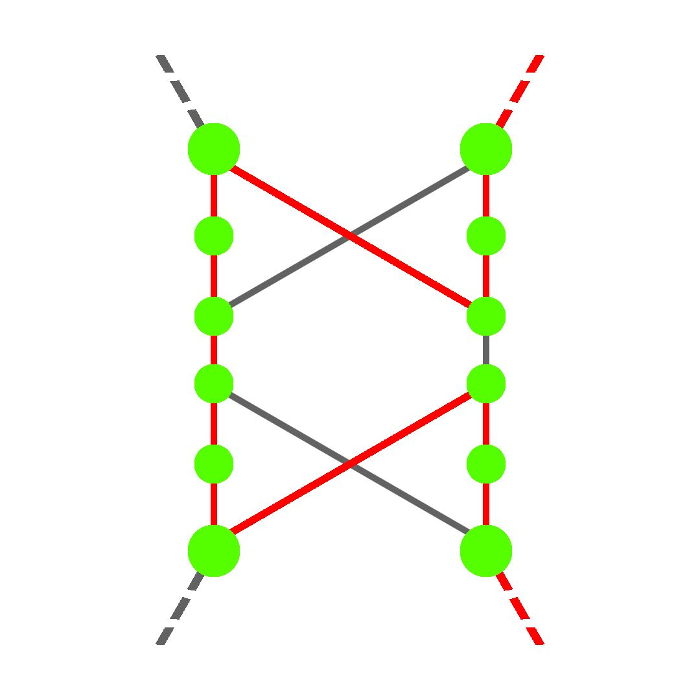
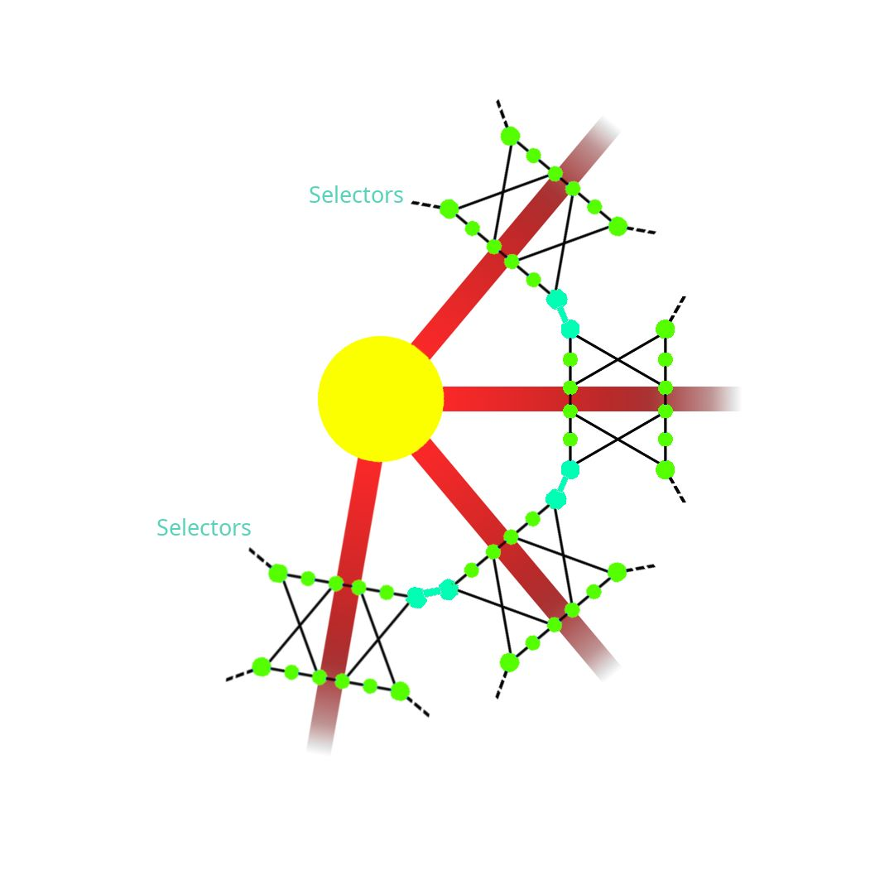

# Proving Hamiltonian Circuit NP-Completeness
Authors: 
 - Ayob Asrout Vargas
 - Dario Cerviño Luridiana
 - Enrique Viña Alonso
 - Juan García Santos

# Introduction

## Description of the problem

In this report, we will prove the NP-Completeness of the Hamiltonian Circuit problem, to do so, we will find a way to transform the input of another NP-Complete problem (in our case the Vertex Cover problem) into the input of a Hamiltonian Circuit Problem. 
The procedure used to transform the input must be polynomial and the resulting input for the Hamiltonian Circuit problem must be satisfied if and only if the original input satisfies the Vertex Cover problem.

## Proving the NP-completeness
### Introduction
We define the class of NP Languages as the languages that represent all of the encoded decision problems that a Non-Deterministic Turing Machine (NDTM) can solve in a polynomial time complexity.

The class of languages NP-Complete is defined by the following statement: 

A language L is NP-Complete if it satisfies the following conditions:
$$L \in NP$$
$$\forall L' \in NP \quad  \exists L' \propto L$$

This means, if the language L is NP-complete, it must belong to the NP class and every other language L' that belongs to the NP class must have a polynomial transformation to L.

Furthermore, if a language L' is known to be NP-complete, a polynomial transformation to L confirms L is also NP-complete. In formal terms:
$$L \in NP$$
$$L' \in NP_{Complete}$$
$$\exists L' \propto L \implies L \in NP_{Complete}$$

Knowing this, we can prove that the Hamiltonian Circuit problem is NP-Complete, by proving that it belongs to the NP language class and finding a polynomial transformation from Vertex Cover (a known NP-complete language) to Hamiltonian Circuit.

### Vertex Cover Problem
A Vertex Cover is a subset of vertices from a graph that contains at least one endpoint of every edge of the graph, the problem of finding a Minimum Vertex Cover is a classical optimization problem and its NP-Complete.

The formal definition of the problem would be:    

<p align="center">
Given a Graph $G=(V, E)$ and an integer $K \in \mathbb{N}$
 </p>
 <p align="center">
The Vertex Cover $V' \subseteq V \ : \  uv \in E \Rightarrow (u \in V' \lor v \in V')$
  </p>
  <p align="center">
Can we find a vertex cover with $|V'| = K$?
</p>

   
We know the Vertex Cover problem is NP-Complete because its "easy" to find a polynomial time algorithm to solve it in a non-deterministic turing machine, and it has been proven that the Vertex Cover problem is NP-Complete, it has been found a polynomial transformation from the 3-SAT problem to Vertex Cover. 

### Hamiltonian Circuit Problem

The Hamiltonian Circuit problem consists of finding a cycle in a graph where every node of the graph apears only once.

The formal definition of the problem is: 

<p align="center">
Given a Graph $G = (V, E)$
 </p>
  
<p align="center">
Does $G$ contain a Hamiltonian circuit? 
</p>
  
<p align="center">
 That is, an ordering $<v_1, v_2, ..., v_n>$ of the vertices of  $G$
 </p>
  
<p align="center">
where $n = |V| \ : \  (\{v_n, v_1\} \in E) \land (\{ v_i, v_{i+1}\} \in E) \quad \forall i, \  1\leq i < n$
 </p>
  
### Proving Hamiltonian Circuit $\in$ NP
To prove that the Hamiltonian Circuit problem is in NP we will be using the Certifier-Certificate based definition of NP. This way of proving if a problem is in NP relies on having a certificate (solution to the problem) and a certifier (a way of checking if the certificate is a solution to the problem) in polynomial time, if so, the problem is in NP.

Given a 'certificate' for the Hamiltonian Circuit problem, this is a sequence of vertices forming the hamiltonian cycle, we will be able to verify the certificate by checking that all of the vertices belong to the graph and each pair of vertices in the certificate are adjacent: 


```
Polynomial verifier for Hamiltonian cycle:


for {u, v} in V' where v = u+1
    if E does not contain {u, v}
        Solution is incorrect
    endif
endfor
Solution is correct
\end{lstlisting}
```                   

### Polynomial Transformation
The polynomial transformation from Vertex Cover to Hamiltonian Circuit is based in the construction of components, specifically, we will have two types of components, the selectors and the more complex cover-testing components.

#### Selectors
The selectors is the simplest set of components we will need to do the transformation, its just a set of vertices $S = \{a_1, a_2, ..., a_k\}$ with $|S| = K$ where $K$ is the size of the vertex cover.

#### Cover-Testing components
We will add a Cover-Testing component for every arc in the original Vertex Cover Graph. The purpose of these Cover-Testing components is to ensure that at least one of the vertices of the original arc is in the Vertex Cover.

For each $e = \{u, v\} \in E$ of the Vertex Cover graph a cover testing component has: 
<p align="center">
A vertex set $V'_e = \{(u, e, i), (v, e, i): 1 \le i \le 6\} \text{ with } |V'_e| = 12$
</p>
<p align="center">
And edges $E'_e = \{\{ (u, e, i), (u, e, i+1)\} \{(v, e, i), (v, e, i+1)\} : 1 \le i \le 5\}$
</p>
<p align="center">
 $\cup \{\{(u, e, 3), (v, e, 1)\}, \{(v, e, 3), (u, e, 1)\}\}$
</p>
<p align="center">
 $\cup \{\{(u, e, 6), (v, e, 4)\}, \{(v, e, 6), (u, e, 4)\}\}$
</p>
<p align="center"> 
 $\text{ resulting in } |E'_e| = 14$
</p>

<p align="center"> 
<table>
    <thead>
        <tr>
         <p align="center">
               
    </p> 
        </tr>
    </thead> 
 <tbody>
        <tr>
         <p align="center">
            Cover-Testing construction             
         </p> 
        </tr>       
    </tbody>
</table>
</p>  


This constructions makes sure that the only vertices that will be involved in any external edges are $(u, e, 1), (v, e, 1), (u, e, 6)$ and $(v, e, 6)$. This implies that any Hamiltonian circuit of G' will only be able to pass through the edges of every vertex cover in one of the three following configurations: 

<p align="center"> 
<table>
    <thead>
        <tr>
<p align="center">      
        
</p> 
    </p> 
        </tr>
    </thead> 
 <tbody>
        <tr>
<p align="center">      
The three possible configurations, of the Hamiltonian Circuit of a Cover Testing for an edge $e = \{u, v\}$. From left to right, they correspond to the cases where only u is part of the vertex cover, where both $u$ and $v$ are part of the vertex cover and where only $v$ is part of the vertex cover</td>  
       </p> 
        </tr>       
    </tbody>
</table>
</p>  


#### Joining the components
After placing one Cover-Testing in every arc of the original Graph, we'll need aditional arcs to connect pairs of Cover-Testing components or a selector with a Cover-Testing component. 
To do this, for each vertex $v \in V$ we will order all of the incident edges on v and all of the Cover-Testing components corresponding to those edges are joined together adding the following edges: 

<p align="center"> 
$E'_v = \{\{(v, e_{v[i]},6), (v, e_{v[i+1]}, 1)\}: 1$ $\le i < deg(v)\}$ Where $deg(v)$ is the degree of  $v$
</p>
 
This additional edges will form paths between Cover-Testing components, and the final connecting edges in G' will join the first and last vertices from each of these paths to the selector vertices $S = \{a_1, a_2, ..., a_k\}$

<p align="center"> 
$E'' =  \{\{a_i,(v, e_{v[1]}, 1)\}, \{a_i, (v, e_{v[deg(v)]}, 6)\}: 1 \le i \le K, v \in V\}$
</p>

<p align="center"> 
<table>
    <thead>
        <tr>
         <p align="center">
               
    </p> 
        </tr>
    </thead> 
 <tbody>
        <tr>
         <p align="center">
            Example of the path made by connecting all the Cover-Testing components from a vertex from the original graph.   
         </p> 
        </tr>       
    </tbody>
</table>
</p>  

#### Final demonstration
The resulting graph $G = (V', E')$ of the transformation has: 

<p align="center"> 
$V' = \{a_,:1\le i\le K\} \cup (\bigcup\limits_{e\in E} V'_e)$
</p> 

<p align="center"> 
and
</p>

<p align="center"> 
$E' = (\bigcup\limits_{e \in E} E'_e) \cup (\bigcup\limits_{e \in E} E'_v) \cup E''$
</p>
Its easy to see how the transformation has polynomial complexity:

```markdown
Generate 12*|E| Cover-Testing vertices + 
    K selector vertices                      O(n)
Generate the 14*|E| Cover-Testing internal edges + 
    2*|E|-1 connections between components + 
    k*2*|E| selector edges                   O(nk)
```

All this ensures that:

- For a Cover-Testing Component to be part of a Hamiltonian Circuit, it must exit from the same side it enters (enters from $(u,(u,v),1)$, must exit from $(u,(u,v),6)$ ).
- For a Cover-Testing Component to be part of a Hamiltonian Circuit, all components chained with it must be traversed, exiting and ending in selectors.
- Due to the limited number of selectors, only K chains of Components can be traversed, corresponding to K vertices in the from the Vertex Cover on the original graph.
  
Finally, we have built a Graph $G' = (V', E')$ such as if a solution to the Vertex Cover Problem with size K exists on graph $G$, then there has to exist a Hamiltonian Circuit in $G'$.

## Sources
- Computers and Intractability: A Guide to the Theory of NP-Completeness - Garey, Johnson
- [Hamiltonian Path on Wikipedia](https://en.wikipedia.org/wiki/Hamiltonian_path)
- [Proof that Hamiltonian Cycle is NP-Complete by GeeksForGeeks](https://www.geeksforgeeks.org/proof-that-hamiltonian-cycle-is-np-complete/)
- [NP on Wikipedia](https://en.wikipedia.org/wiki/NP_(complexity))


